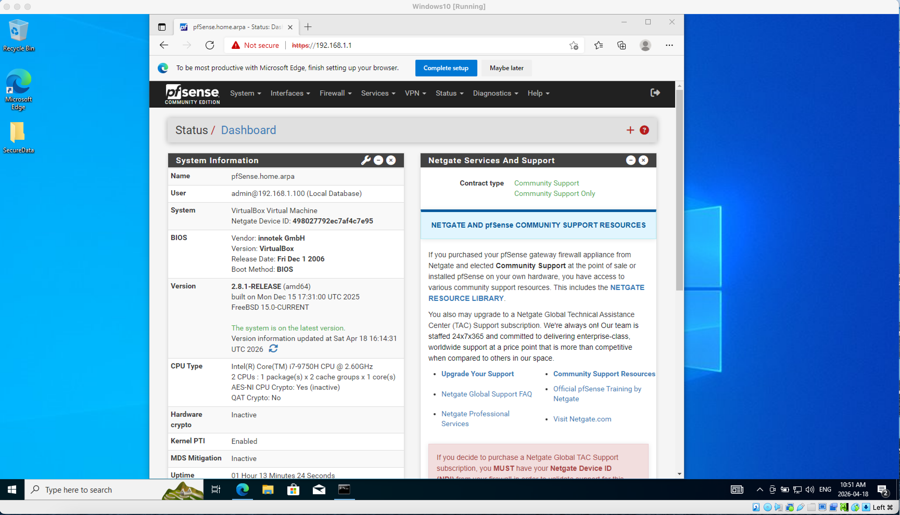
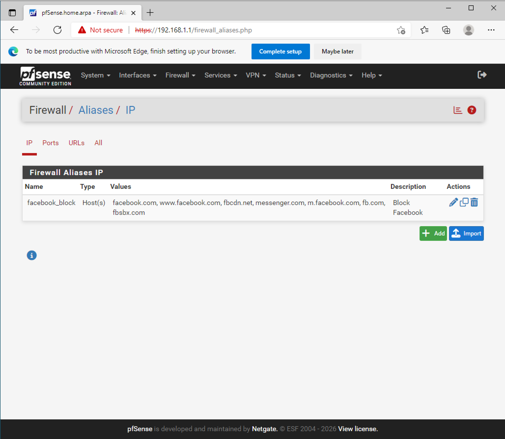
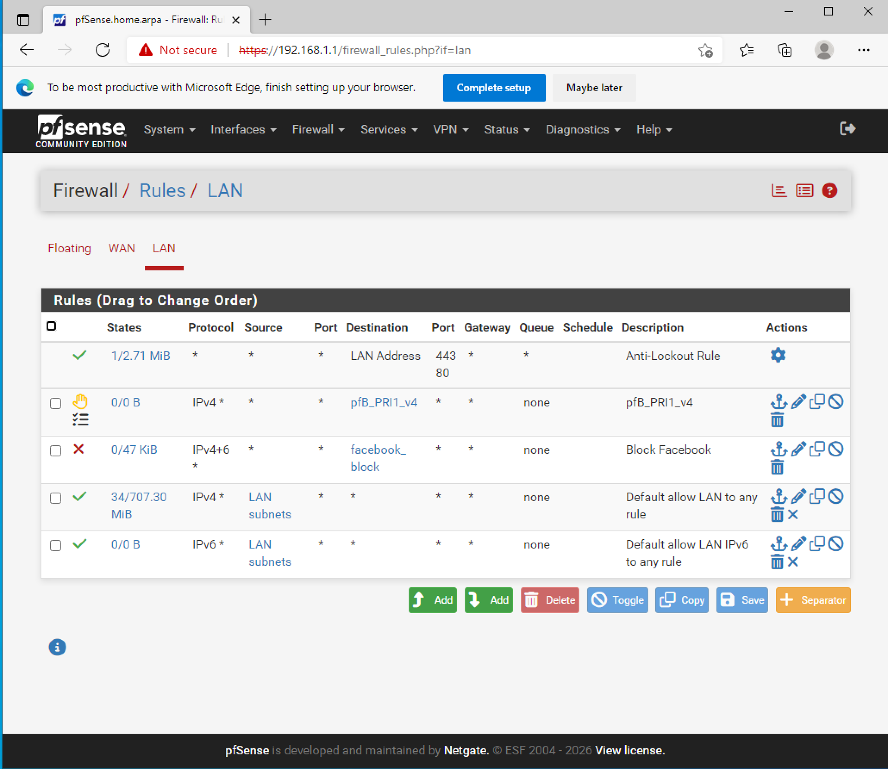
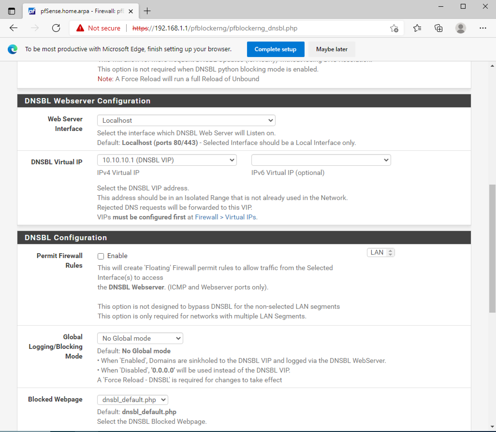
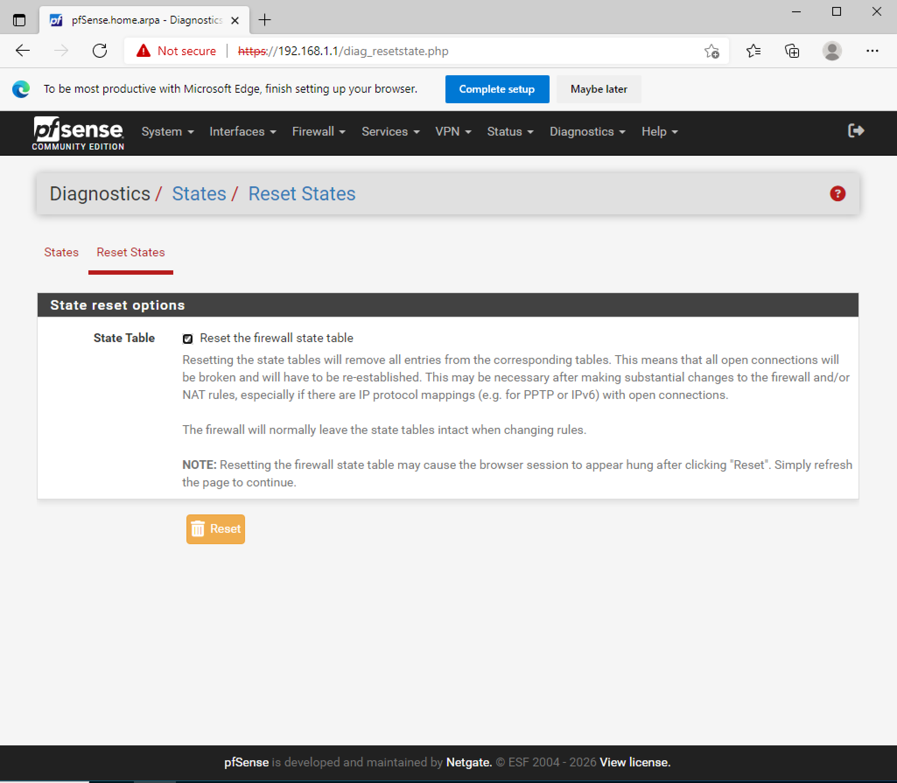
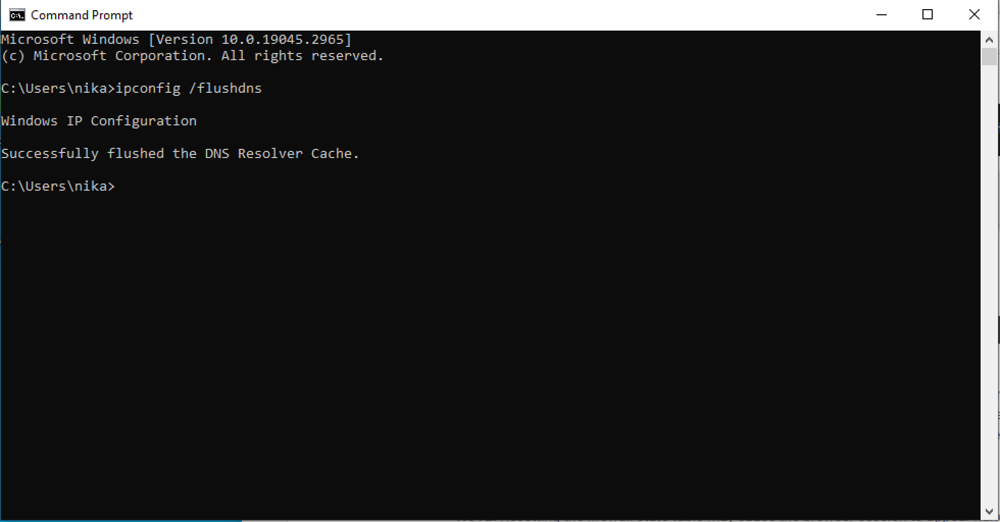

# pfSense Facebook Blocking Lab

## Overview
This lab demonstrates how to block access to Facebook using pfSense firewall and DNS filtering (pfBlockerNG).

## Tools Used
- pfSense
- pfBlockerNG
- VirtualBox
- Windows 10 VM

## What I Did
- Installed and configured pfBlockerNG
- Created firewall alias for Facebook domains
- Configured firewall rules to block traffic
- Set up DNSBL filtering
- Flushed DNS cache on Windows
- Verified blocking result

## Result
Facebook access was successfully blocked. The browser returns a timeout error, confirming that traffic is filtered.

## Screenshots

### Lab environment
.png)

### pfSense dashboard

### Firewall alias (Facebook domains)

### Firewall rule

### DNSBL configuration

### Reset firewall states

### Flush DNS cache

### Blocked result
.png)

## Skills Gained
- Firewall configuration
- DNS filtering (DNSBL)
- Network troubleshooting
- Traffic control using pfSense
